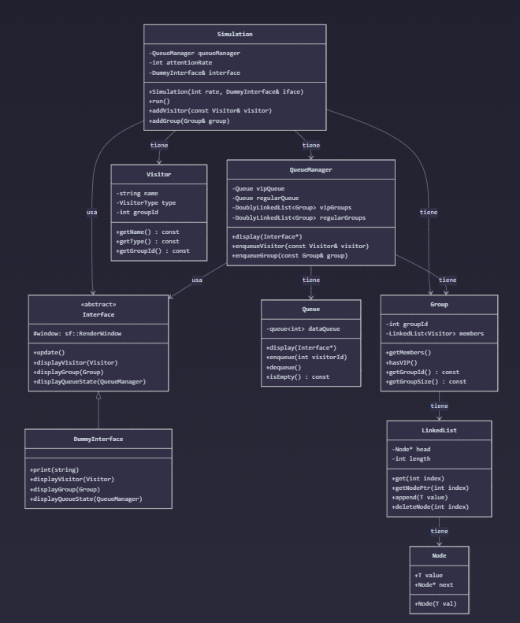

# IE0217_Group6
Desarrollo del proyecto final del curso IE0217 de la Universidad de Costa Rica

# Integrantes
- Adrian Cordero Mendez, B82305
- Faustin Acuña Burgos, B90054

## Preparación

### Instalar paquete sfml

En Linux:
sudo apt update
sudo apt install libsfml-dev

En Windows:
vcpkg install sfml
vcpkg integrate install

# Como ejecutar

- Usa "make run" para compilar
- Usa "make runAll" para compilar y ejecutar

# Diagrama

